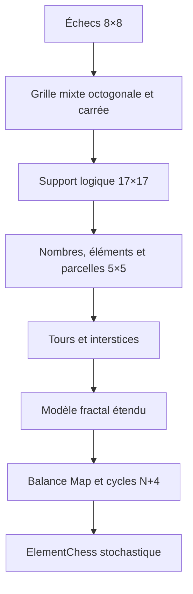

# ElementChess — transformer les échecs en jeu de stratégie stochastique

ElementChess est une preuve de concept Python qui transforme les échecs,
jeu de stratégie déterministe à information complète, en un jeu de stratégie
stochastique à plusieurs conditions de victoire et de défaite.

Le projet conserve les pièces et les mouvements des échecs, puis ajoute :

- un support mixte de 17×17 cellules ;
- neuf parcelles territoriales de 5×5 ;
- des valeurs numériques de 1 à 5 ;
- huit éléments actifs ou passifs ;
- des jetons, des orientations et des combats probabilistes ;
- un interstice entre les rondes ;
- un système de permutation piloté par la Balance Map.

Le prototype ne contient aucune ressource graphique externe et ne dépend ni
d'un service réseau, ni de Steam. Son objectif est de rendre le concept
jouable, observable et testable avant le portage C++/SFML.

> English summary: a playable Python proof of concept that transforms classical chess into a stochastic strategy game with territorial grids, elemental states, probabilistic combat and adaptive balancing.

## Transformation générale



La spécification conceptuelle suit cette transformation pas à pas :

- [Transformation des échecs vers ElementChess](docs/ELEMENTCHESS.md)
- [Formules d’attaque, de défense et d’équilibrage](BALANCE.md)
- [Dictionnaire statistique adaptatif](docs/BALANCE_MAP_DICTIONARY.md)
- [Paramètres de la Balance Map](config/balance-map.template.json)
- [Publication GitHub et exécutable Windows](docs/REPOSITORY.md)

## Télécharger et jouer sous Windows

Les versions publiées proposent une archive `ElementChess-Windows-x64.zip`.
Après extraction, un double-clic sur `ElementChess.exe` lance directement
l'interface graphique, sans installer Python et sans ouvrir VS Code ou un
terminal.

L'exécutable est généré et testé automatiquement par GitHub Actions. Il n'est
pas stocké dans le code source du dépôt afin de garder un historique léger et
vérifiable.

### Créer l'exécutable sans utiliser l'invite de commandes

Le propriétaire du projet peut double-cliquer sur :

```text
CREER-EXECUTABLE-WINDOWS.bat
```

Le fichier vérifie le jeu, fabrique `dist/ElementChess.exe`, puis crée
`ElementChess-Windows-x64.zip`. C'est cette archive qu'il faut déposer sur
GitHub et transmettre aux testeurs. Les testeurs n'ont ensuite besoin ni de
Python ni du fichier `main.py`.

## Exécution

Python 3.11 ou plus récent est recommandé. Aucune dépendance externe n'est
requise.

```bash
python main.py
```

ou :

```bash
python -m elementchess
```

Tests :

```bash
python -m unittest discover -s tests -v
```

Rapport statistique reproductible :

```bash
python -m elementchess.balance_simulation --iterations 10000 --seed 426
```

## Commandes principales

| Commande | Fonction |
|---|---|
| `1` ou `T` | Vue territoriale |
| `2` ou `E` | Vue mixte pièces/terrain |
| `Maj` maintenu | Affichage temporaire des nombres |
| `Ctrl` maintenu | Potentiels d'attaque et de défense au survol |
| `Alt` maintenu | Sélection défensive roi-tour |
| `4` ou `H` | Roues et interstice |
| `F1` ou `G` | Notice de jeu |
| `F2` ou `L` | Scénarios de simulation |
| `F11` | Plein écran |

## Portée du dépôt

Ce dépôt documente un cas d'application du **modèle fractal universel étendu**.
Il succède au cas d'application consacré au modèle de restaurant, dans lequel
la même famille de structures reliait les stocks alimentaires réels aux
produits proposés à la carte et à leurs valeurs caloriques.

Le changement de domaine est volontaire : le modèle passe d'un système de
stocks et de transformations alimentaires à un système de listes, d'états et
de transformations ludiques dépendant du temps.

## Questions fréquentes

### Qu'est-ce qu'ElementChess ?

ElementChess est une transformation expérimentale des échecs. Les mouvements classiques restent présents, mais le plateau, les territoires, les éléments, les jetons et les probabilités ajoutent plusieurs axes stratégiques.

### Est-ce un jeu d'échecs classique ?

Non. Il utilise les pièces et une partie des règles des échecs comme référence, puis ajoute des conditions de victoire, des combats stochastiques et un système territorial.

### Pourquoi le plateau comporte-t-il 17 × 17 cellules ?

La grille mixte intercale les positions réservées aux pièces avec les cellules territoriales nécessaires aux valeurs, éléments et parcelles de 5 × 5.

### La partie dépend-elle uniquement du hasard ?

Non. Les décisions de placement, déplacement et orientation structurent les possibilités. Le hasard intervient dans certaines résolutions et le système d'équilibrage, sans remplacer la stratégie.

### À quoi sert la Balance Map ?

Elle mesure l'état de la partie et peut déclencher des permutations encadrées afin de limiter certains blocages et de maintenir des dilemmes entre stratégie échiquéenne, conquête territoriale et gestion du risque.

### Faut-il installer Python pour tester la version Windows ?

Non lorsque vous téléchargez l'archive publiée contenant `ElementChess.exe`. Python est seulement nécessaire pour exécuter le code source.

### Existe-t-il un mode en ligne ou Steam ?

Pas dans cette preuve de concept. Le dépôt valide d'abord les règles et le gameplay avant le portage C++/SFML et les futures fonctions réseau.

### Le prototype est-il terminé ?

Non. Il s'agit d'une version de test destinée à recueillir des retours sur les règles, l'équilibrage et l'expérience de jeu.

## Modèle de référence et cas précédent

- [Modèle fractal universel étendu](https://github.com/E1LaeTID/modele-fractal-universel-etendu)
- [Carte calorique multilangage](https://github.com/E1LaeTID/carte-calorique-multilangage)
- [Portail des projets E1LaeTID](https://e1laetid.github.io/)

## Licence

Le code et la documentation sont publiés sous l'**ElementChess Public
Evaluation License 1.0**. La consultation, l'exécution, les tests et les forks
non commerciaux sont permis. Toute exploitation commerciale, redistribution
d'un exécutable modifié ou publication sur une plateforme commerciale exige
une autorisation écrite distincte.
