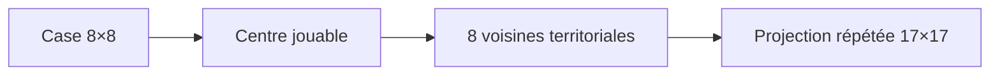
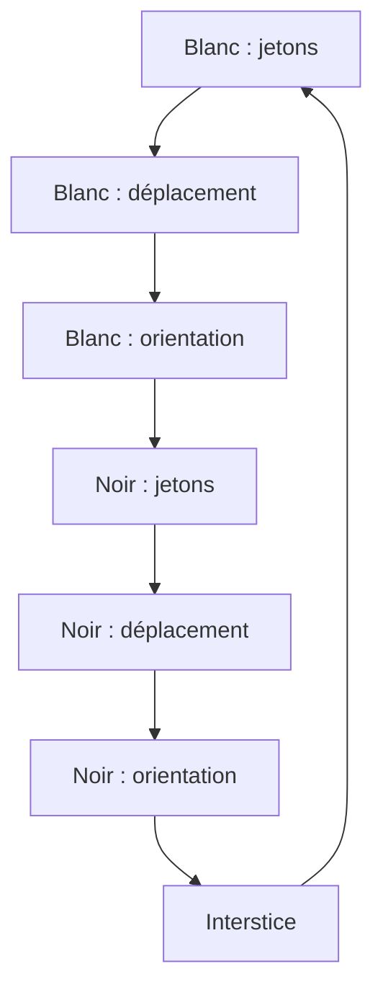
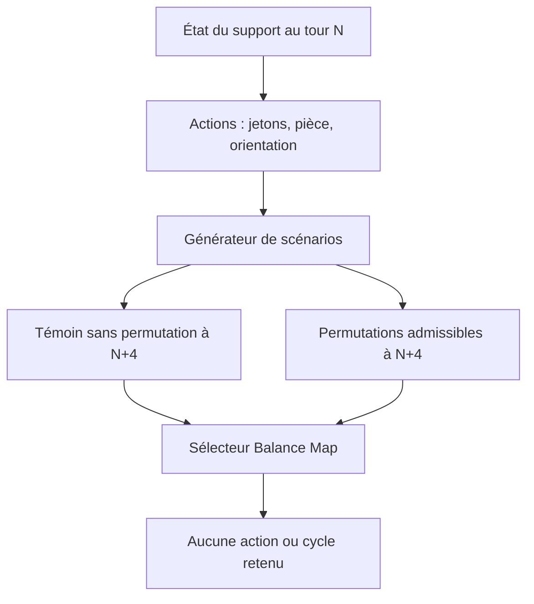

# Des échecs classiques à ElementChess

## 1. Objet du projet

Les échecs classiques reposent sur un plateau 8×8, deux armées, des mouvements
déterministes et une condition terminale principale : l'échec et mat.
ElementChess conserve ce noyau, mais introduit un support territorial, des
états élémentaires et des tirages. Rejouer les mêmes déplacements ne garantit
donc plus les mêmes effets.

La version Python est un **proof of concept console graphique**. Elle vérifie
les règles, les transitions et l'équilibrage avant toute production graphique
ou intégration multijoueur.

## 2. Du plateau 8×8 au support 17×17

Une case d'échecs devient le centre d'un environnement de huit cellules. Cette
lecture octogonale permet d'attacher des informations autour de chaque pièce
sans modifier ses déplacements classiques.

Les 64 cases de jeu sont projetées sur les coordonnées impaires de la grille
17×17 :

\[
(x_t,y_t)=(2x_e+1,\;2y_e+1),
\qquad x_e,y_e\in\{0,\ldots,7\}.
\]

Le support obtenu contient 289 cellules : 64 cellules de jeu et 225 cellules
territoriales.

## 3. Cellules, parcelles et bande limite

| Objet | Rôle |
|---|---|
| Cellule de jeu | Reçoit une pièce et son orientation ; aucune donnée territoriale |
| Cellule terrain | Reçoit un élément et éventuellement un nombre de 1 à 5 |
| Parcelle 5×5 | Support local des contraintes numériques et de la capture territoriale |
| Bande limite | Couronne d'une cellule autour du carré central 15×15 |

Les neuf parcelles 5×5 forment un carré central de 15×15. Elles sont mixtes :
leurs cellules de jeu interrompent les lignes et colonnes numériques. La bande
limite ferme le support et porte elle aussi des éléments, mais aucun numéro.

Chaque cellule terrain possède deux données indépendantes :

\[
n(c)\in\{1,2,3,4,5\}\cup\{\varnothing\},
\qquad e(c)\in\mathcal E,
\]

avec :

\[
\mathcal E=\{\text{Eau, Feu, Vent, Bois, Terre, Glace, Magmat, Foudre}\}.
\]

## 4. Relations élémentaires actives et passives

Une relation active contribue positivement à la ligne évaluée. Une relation
passive applique la relation complémentaire et contribue négativement. Les
niveaux simple, double et triple restent indépendants des nombres territoriaux.

| Relation | Signe | Niveau 1 | Niveau 2 | Niveau 3 |
|---|---:|---:|---:|---:|
| Active | `+` | `+50` | `+100` | `+150` |
| Passive | `−` | `−50` | `−100` | `−150` |

Les rapports complémentaires peuvent aussi être lus comme deux signatures
inverses, par exemple `2` et `1/2`, ou `3` et `1/3`. Dans le calcul de combat,
ils sont convertis sur l'échelle additive ci-dessus afin de ne pas mélanger la
granularité des éléments avec celle des nombres 1 à 5.

## 5. Définition des états actif et passif

L'état n'est pas une propriété permanente de l'élément : il dépend de la
commande produite à l'interstice.

- **Actif** : commande positive ; la signature se propage sur les cellules du
  support portant le même élément.
- **Passif** : commande négative ; la signature complémentaire se propage sur
  ces mêmes cellules.
- **Neutre** : commande nulle ; aucun opérateur élémentaire n'est appliqué.

L'amplitude absolue de la commande sélectionne le niveau simple, double ou
triple. Un effet calculé au tour `n` commence à `n+1` et possède une échéance :
les puissances ne peuvent pas croître sans limite.

## 6. Roue principale et roues élémentaires

Le système temporel comprend une roue principale, sept roues élémentaires et
une crémaillère pour la Glace. Une impulsion de la roue principale se propage
dans le train mécanique ; chaque contact inverse le sens de rotation.

Les roues ont deux fonctions distinctes :

1. représenter le temps et les transformations de l'interstice ;
2. produire les signatures actives, passives ou neutres consommées au tour
   suivant.

La roue principale n'est pas commandée directement par le joueur. Les roues
élémentaires reçoivent des incréments issus de l'état numéroté et possédé du
terrain.

## 7. Déroulement d'une ronde

Pour chaque joueur :

1. placer un ou plusieurs jetons autorisés, les conserver ou recycler une
   parcelle non capturée ;
2. déplacer une pièce selon les règles d'échecs ;
3. résoudre un éventuel combat ;
4. orienter la pièce déplacée ;
5. verrouiller l'orientation.

À l'interstice :

1. trois éléments distincts sont tirés ;
2. les orientations correspondantes peuvent compléter des lignes et colonnes ;
3. chaque joueur reçoit de nouveaux jetons dans la limite de 21 ;
4. l'état du terrain produit les commandes des roues ;
5. les signatures élémentaires sont mises à jour ;
6. la Balance Map vérifie les blocages et les écarts statistiques.

## 8. Victoires et défaites

| Événement | Issue |
|---|---|
| Échec et mat du roi adverse | Victoire |
| Trois parcelles capturées et alignées | Victoire |
| Réserve portée à 21 selon la règle terminale | Victoire territoriale/économique |
| Trois attaques du même joueur repoussées | Défaite de l'attaquant |
| Attaque défensive repoussée alors que le roi reste en échec | Défaite immédiate |

La condition terminale est évaluée après chaque transition sensible. La
fenêtre finale nomme le gagnant, le perdant et la cause, puis propose une
nouvelle partie ou la fermeture du jeu.

## 9. Inventaire des listes et formules

### Listes structurelles

- cellules globales 17×17 ;
- 64 cellules de jeu ;
- cellules territoriales ;
- neuf parcelles 5×5 ;
- cellules de chaque pièce et environnement adjacent ;
- pièces, propriétaires, orientations et déplacements légaux ;
- valeurs 1 à 5, jetons et propriétaires ;
- huit éléments et signatures actives/passives ;
- événements du tour et de l'interstice ;
- permutations admissibles et historique des tirages.

### Formules essentielles

Projection de l'échiquier :

\[
(x_t,y_t)=(2x_e+1,2y_e+1).
\]

Coefficient de ligne et puissance de ligne :

\[
C(y)=50|y-8|,\qquad LP(y)=100+C(y).
\]

Puissance finale :

\[
P=\max\left(100,
\operatorname{moyenne}(L_i)+20V_p+B_o+5S_n\right).
\]

Probabilité de rejet :

\[
P_R=\operatorname{borne}\left(
\frac13+\frac{D-A}{900},\;0{,}12,\;0{,}65
\right),\qquad P_C=1-P_R.
\]

Candidats numériques d'une cellule :

\[
K(c)=\{1,2,3,4,5\}\setminus
\bigl(V_{\text{segment ligne}}(c)\cup V_{\text{segment colonne}}(c)\bigr).
\]

Les détails des trois géométries de confrontation figurent dans
[`BALANCE.md`](../BALANCE.md).

## 10. Modèle fractal universel étendu

Le changement de grille engendre plusieurs listes de même forme générale : un
support, des entités, des états, des opérations et des transitions. Le modèle
fractal étendu applique le même patron à plusieurs échelles :

| Échelle | Support | Entité | État | Transformation |
|---|---|---|---|---|
| Cellule | Coordonnée | nombre/élément/pièce | libre, occupée, active… | affectation |
| Parcelle | matrice 5×5 | cellules | ouverte, bloquée, capturée | rotation/transposition |
| Plateau | matrice 17×17 | parcelles et pièces | phase de jeu | permutation globale |
| Partie | suite de rondes | joueurs/actions | début, milieu, fin | cycle temporel |

La structure géométrique et les coordonnées restent invariantes. Les valeurs,
états et relations constituent la partie évolutive. Cette séparation permet de
réutiliser les mêmes opérations sans confondre leurs domaines numériques.

## 11. Balance Map

La Balance Map relie la structure horizontale du jeu à un axe vertical
temporel. Cet axe ajoute deux objets :

- le **cycle**, qui détermine quand un état doit être réévalué ;
- le **générateur**, qui produit les listes de possibilités et les scénarios
  comparables.

Les actions du joueur alimentent donc le système sans lui retirer sa décision :

- le placement des jetons modifie la résolution territoriale ;
- le déplacement modifie la structure échiquéenne ;
- l'orientation modifie les relations élémentaires futures.

La Balance Map ne choisit pas un gagnant. Elle prévient un blocage ou produit
un dilemme lorsque les chemins vers les différentes issues deviennent trop
déséquilibrés. Le scénario sans permutation reste toujours admissible.

## 12. Conditions stochastiques et phases de jeu

Le système observe notamment : remplissage territorial, terrains capturés,
matériel restant, stocks, attaques repoussées, puissance des combats et
pression d'échec et mat.

Le score d'avancement général est :

\[
G(s)=\sum_i w_i f_i(s),\qquad \sum_i w_i=1.
\]

Les limites de phase sont apprises sur les trajectoires de référence :

\[
L_1=Q_{1/3}(G),\qquad L_2=Q_{2/3}(G).
\]

| Phase | Rôle de l'équilibrage |
|---|---|
| Début | Observer ; laisser apparaître les stratégies et asymétries initiales |
| Milieu | Prévenir les blocages et stimuler les dilemmes territoire/position |
| Fin | Préserver l'avantage acquis et limiter les interventions |

À l'horizon `N+4`, le témoin sans permutation est comparé aux permutations
numériques locales et élémentaires globales. Une parcelle capturée sort des
cycles numériques. Une parcelle bloquée est corrigée au plus tard après trois
constats consécutifs. Une permutation élémentaire peut intervenir lorsque le
taux de rejet observé devient inférieur à sa référence conditionnelle.

Le double objectif est donc :

1. garantir qu'une partie jouable ne soit pas immobilisée par le support ;
2. maintenir un dilemme entre échec et mat, conquête territoriale, gestion des
   jetons et risque d'attaques repoussées.

## 13. Continuité des cas d'application

ElementChess succède au cas d'application du modèle de restaurant. Celui-ci
reliait les stocks alimentaires réels, les produits disponibles à la carte et
leurs valeurs caloriques. ElementChess reprend la même séparation entre
support invariant, listes d'entités, états mesurés et transformations, puis lui
ajoute un axe temporel stochastique avec cycles et générateur.
